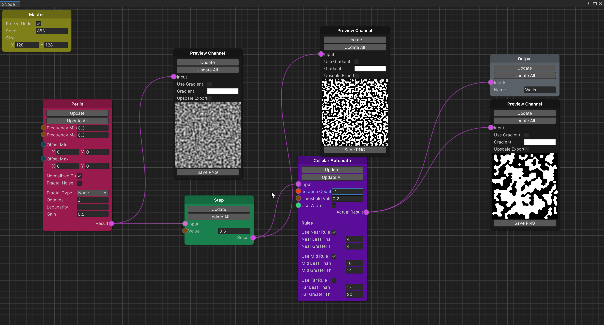
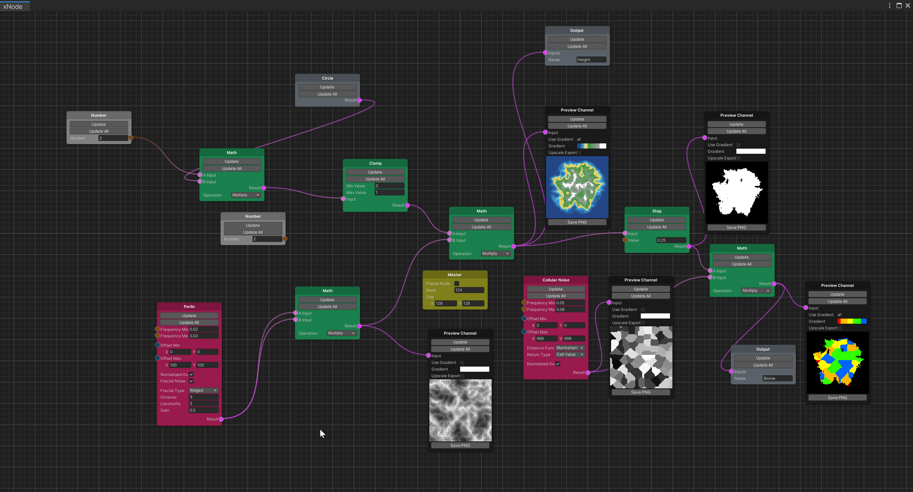
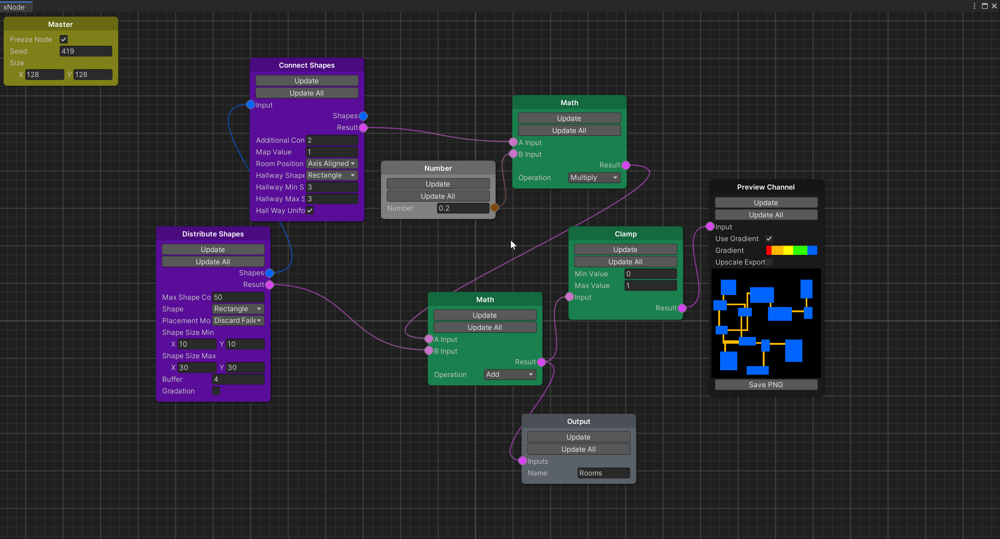

# rlbits-mapping-graphs
rlbits-mapping-graphs is a Unity tool for node-based Procedural Map Generation.  If you've made a game with a procedurally generated map, you know a lot of time is spent swapping between the game view and your inspector (or code), tweaking values until you get it just right.  Using node graphs (like Unity's Shader Graph) is an intuitive way to **make constant tweaks with immediate visual feedback**.  The goal of this package is to decrease the amount of context switching you have to do while tweaking the inputs for your procedural maps.

*A screen cap of the Cave graph included in the samples folder. The cave graph uses noise + cellular nodes*

## Anatomy

### Graph Data

rlbits map graphs uses flat arrays of floats almost across the board.  This is very similar to editing only a single channel of an image - the Preview node even includes the ability to use a lookup gradient to help with visualizing the output.  A few exceptions exist:  Lists of GridShapes (see below), integers, floats and bools are also used for some nodes.

### Runtime

#### ChannelMap.cs

you can use a Channel Map implementation to retrieve the contents of an output node and handle it however you please at runtime. There is a simple Tile-based Channel Map included that maps a single tile to a range of values.

#### RuntimePCG.cs

This is a simple script that sets the input data for a graph, then runs the graph and stores each output nodes channel for use at runtime.

*A screen cap of the Island graph included in the samples folder. The island graph uses noise nodes heavily to generate a heightmap + biomes.*

## Type of nodes

### Cells

These nodes perform cellular logic.  Things like Cellular Automata and Maze generation could be found here.

### Shapes

These Nodes will generate or operate on shapes.  rlbits-mapping has a GridShape class that it uses to pass shapes between nodes.  with these nodes, you can generate different types of shapes and then connect them in different ways.

### Noise

Noise nodes deal with a more organic, noise-based set of functions for generating maps.  You can find a node for each type of noise in the `fastnoiselite` library, such as Voronoi and Perlin.

### Logic

Logic nodes are the kinds of nodes you may also find in other graph libraries - foundational nodes like math, clamp, step and number.

### Other

#### Input Texture

you can use a source as the starting point for many effects.  keep in mind the texture will be up- or down-sampled to match the resolution of the map.

#### Preview

this is a handy utility node to preview the visual state of the graph at any juncture.  Use it often!

#### Output

This node is used by the runtime scripts to retrieve the state of the graph wherever its inserted.

*A screen cap of the Dungeon graph included in the samples folder. The Dungeon sample generates Shapes & connects them with hallways*

